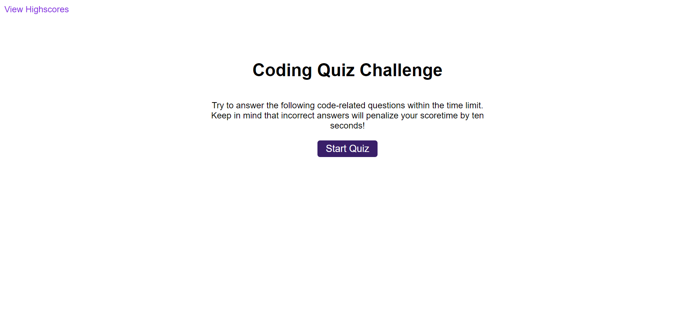

# Quick-Code-Quiz

## Description

This application is a quiz centered around coding. There are five simple questions to answer within the time limit.

## Table of Contents

- [Installation](#installation)
- [Usage](#usage)
- [License](#license)

## Installation

Not necessary

## Usage

To begin, click on the "Start Quiz" button. From there, a series of questions will be presented. Depending on whether or not the question was answered correctly, either "Correct!" or "Wrong!" will appear below the question. If a question is answered incorrectly, time will be subtracted from the timer. The quiz automatically ends once the timer reaches 0. Whether the last question has been answered or time has run out, the user's score is presented, as well as the ability to add their initials to the scoreboard. Once they select the "Submit" button, the user will see their highscore on the page. They have the option to either return to the main screen or clear their score. At the top left of the page there is a "View Highscores" link that will redirect the user to the highscore screen.

## License

MIT License
